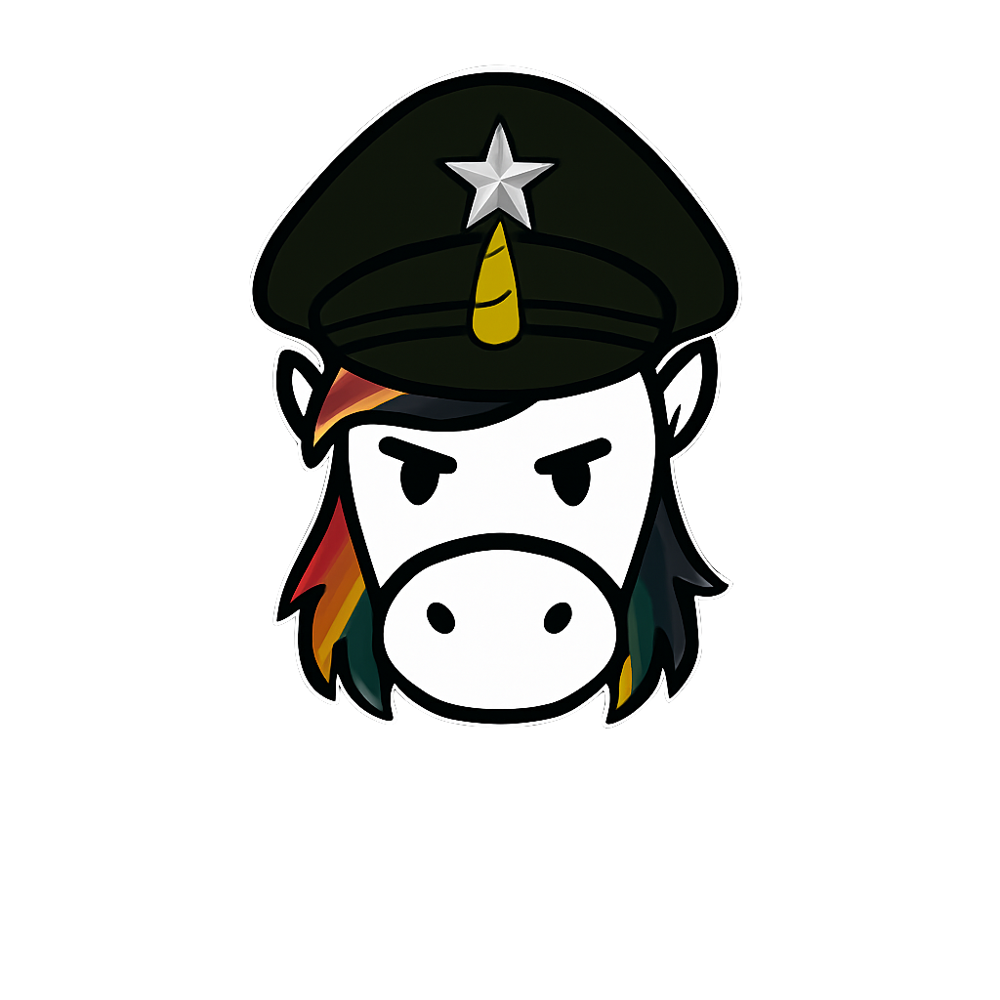
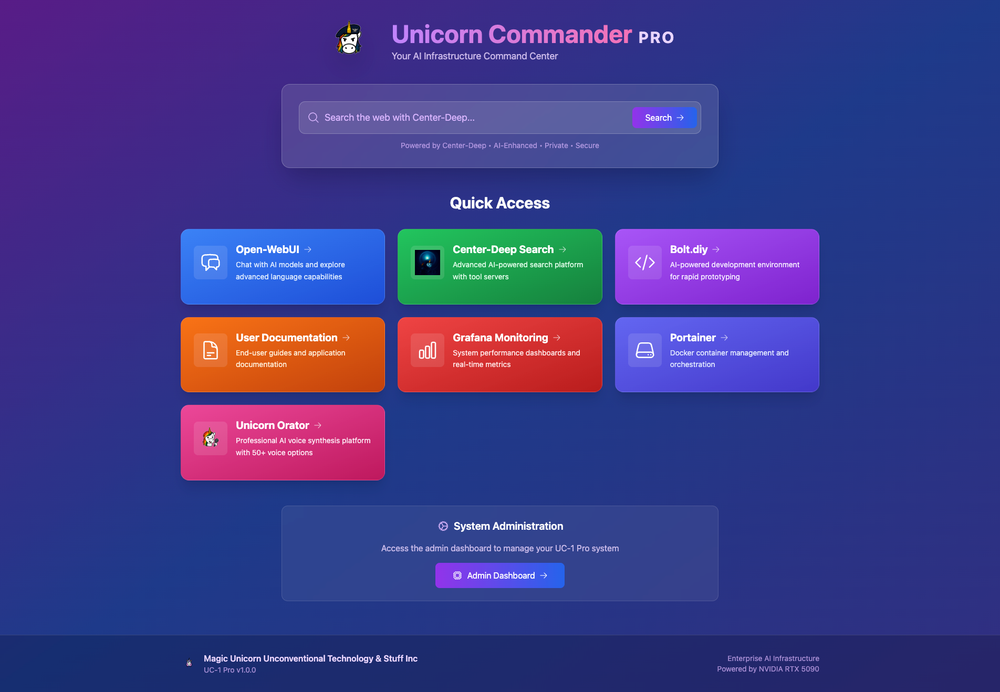
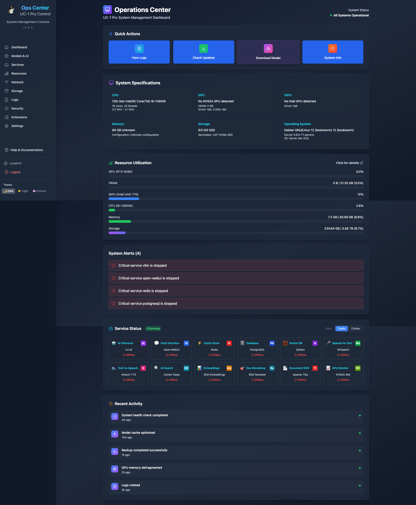
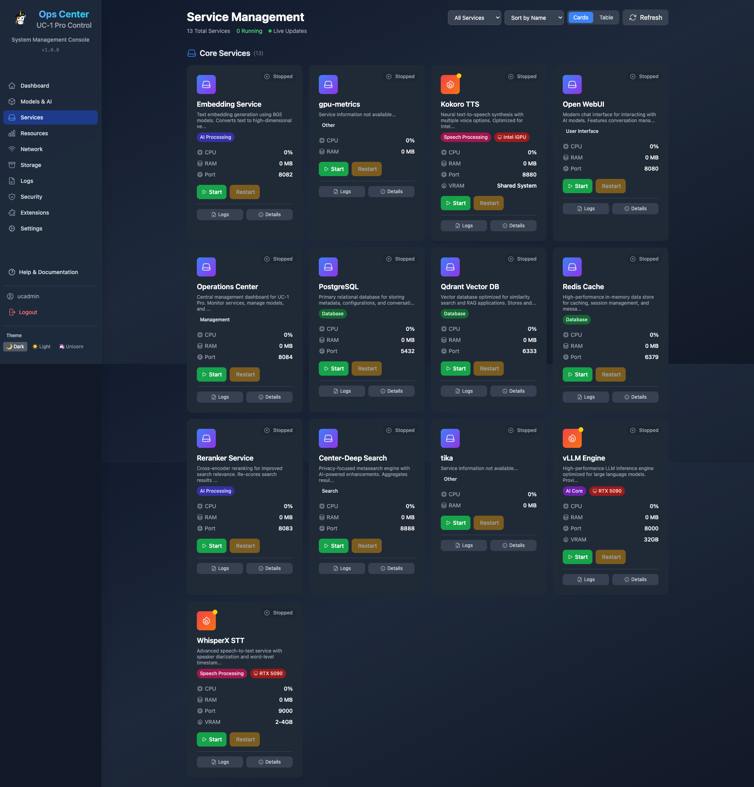
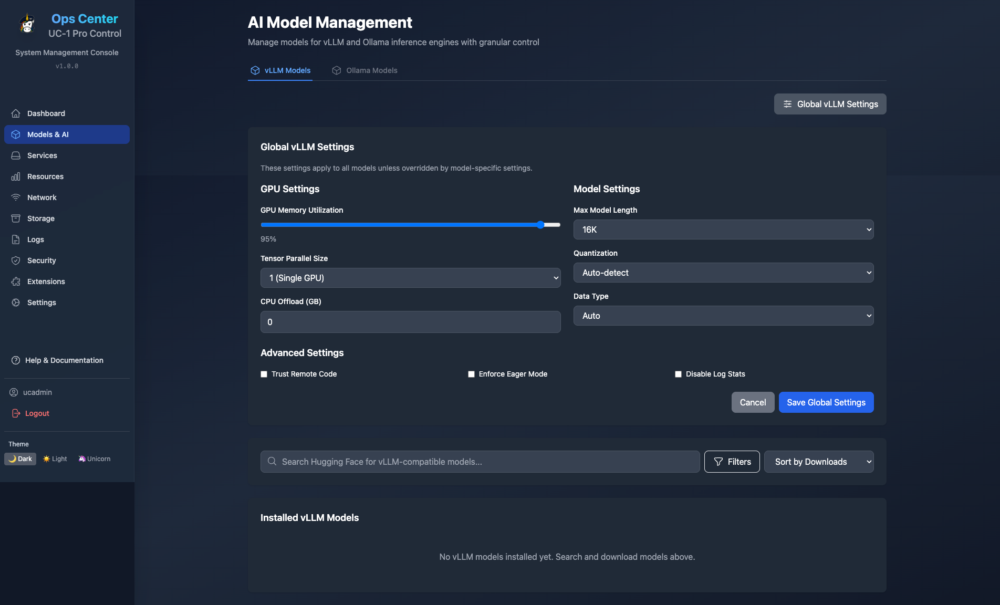
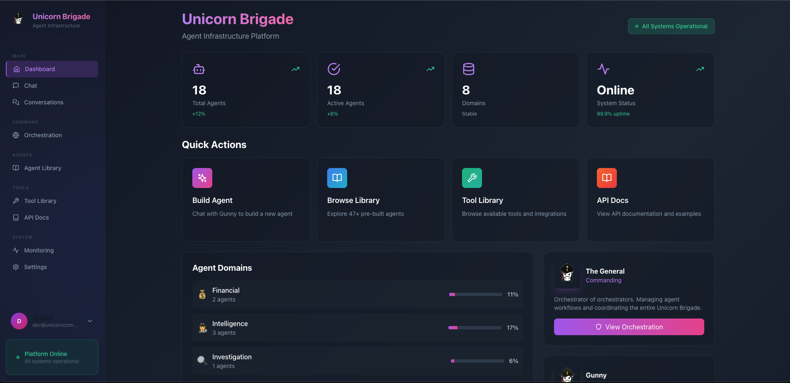
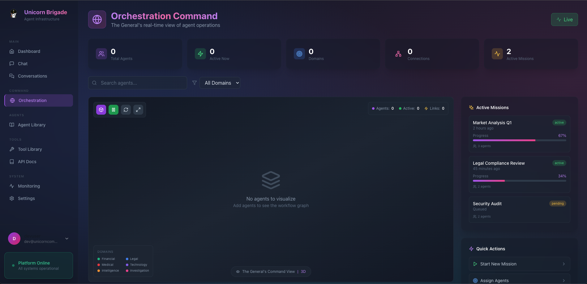
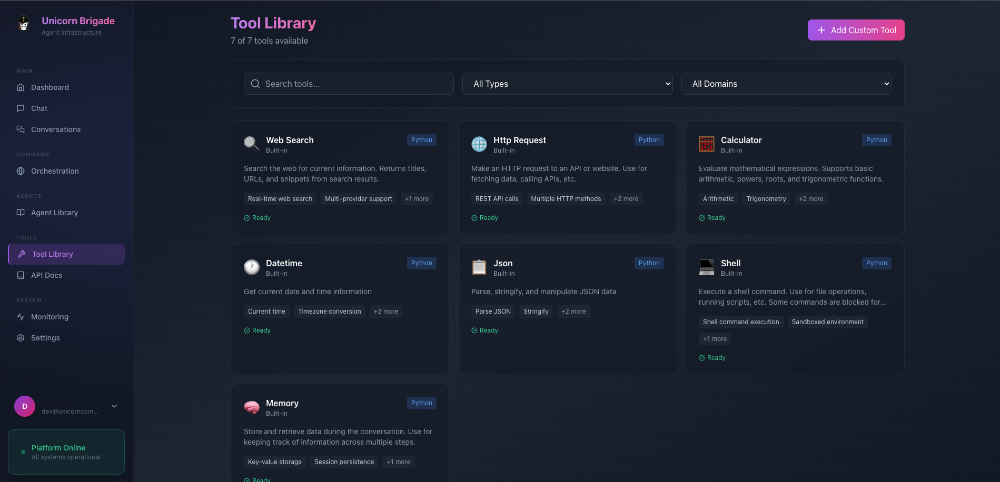

<div align="center">


&nbsp;&nbsp;&nbsp;&nbsp;&nbsp;


# Unicorn Commander

### The Open-Source AI Cloud Platform

*Two battle-tested systems. One integrated stack. Self-hosted. No vendor lock-in.*

[](LICENSE)
[](https://python.org)
[](https://fastapi.tiangolo.com)
[](https://react.dev)
[](https://docs.docker.com/compose/)

[](https://github.com/sponsors/Unicorn-Commander)
[](https://buymeacoffee.com/aaronyo)

**[Quick Start](#-quick-start)** · **[Ops-Center](#-ops-center--the-colonel)** · **[Unicorn Brigade](#-unicorn-brigade--the-general)** · **[Architecture](#-architecture)** · **[Website](https://unicorncommander.com)**

</div>

---

## What Is Unicorn Commander?

Unicorn Commander is a self-hosted AI cloud platform that combines **infrastructure management** with **multi-agent orchestration** into a single integrated stack. It's what you deploy when you want to run your own AI operations — users, billing, LLM routing, agent workflows, voice agents, and 1,360+ tools — without handing your data to someone else.

| System | Role | What It Does |
|--------|------|-------------|
| **[Ops-Center](https://github.com/Unicorn-Commander/Ops-Center-OSS)** (The Colonel) | Infrastructure | Users, orgs, billing, SSO, LLM proxy, service management, credit system |
| **[Unicorn Brigade](https://github.com/Unicorn-Commander/Unicorn-Brigade-OSS)** (The General) | Agent Orchestration | 17 AI agents, workflow engine, 46 MCP servers, voice agents, real-time coordination |

They share authentication (Keycloak SSO), database infrastructure (PostgreSQL), and Brigade routes all LLM calls through Ops-Center for centralized billing and usage tracking.

---

## Ops-Center · The Colonel

> *Your AI infrastructure command center. Manage everything from one dashboard.*

Ops-Center is the admin backbone — user management with bulk operations, subscription billing (Stripe + Lago), multi-tenant organizations, LLM model management, service health monitoring, and a credit system that tracks every API call across your platform.

**624 API endpoints** · **Keycloak SSO** (Google, GitHub, Microsoft) · **Stripe/Lago billing** · **RBAC** · **BYOK support**

<div align="center">

#### User Homepage & Quick Access



The landing page users see — search bar (powered by Center-Deep), quick access cards to all platform services, and admin dashboard link.

---

#### Admin Dashboard — System Overview



Infrastructure at a glance — CPU/GPU/RAM utilization, system alerts, service health grid for 13+ services (PostgreSQL, Redis, Keycloak, vLLM, Ollama, etc.), and recent activity timeline.

---

#### Service Management



Start, stop, and monitor every service in your stack. Per-service CPU, RAM, and disk usage. Container management with one-click restart.

---

#### AI Model Management



Configure vLLM and Ollama models. GPU memory allocation, quantization settings, max model length. Search HuggingFace for compatible models and deploy them directly.

</div>

### Ops-Center Highlights

- **User Management** — Bulk import/export, advanced filtering (10+ fields), role hierarchy, API key management, user impersonation
- **Billing** — Stripe + Lago integration, subscription tiers (Trial → Enterprise), usage metering, credit system with per-model pricing
- **Organizations** — Multi-tenant with org-level feature grants, team roles, invitation system
- **LLM Proxy** — OpenAI-compatible API, routes to OpenRouter/OpenAI/Anthropic/local models, BYOK passthrough (no credits charged)
- **Image Generation** — DALL-E 3, GPT Image 1, Gemini Imagen 3, Stable Diffusion via unified API
- **Configurable Billing** — `BILLING_ENABLED=false` for personal servers, `CREDIT_EXEMPT_TIERS=*` for internal use

---

## Unicorn Brigade · The General

> *The AI agent factory. Build, deploy, and orchestrate autonomous agent teams.*

Unicorn Brigade is where the AI work happens — 17 specialized agents organized into military-style teams, a 3-tier hierarchical workflow engine (Orchestrator → Team Leads → Workers), 46 MCP servers providing ~1,360 enterprise tools, real-time orchestration with SSE streaming, and self-correcting workflows that retry on failure.

**17 agents** · **46 MCP servers** · **~1,360 tools** · **25 workflow templates** · **Voice agents** · **A2A + MCP protocols**

<div align="center">

#### Agent Orchestration Mockup


*Conceptual mockup of multi-agent orchestration coordinating across domains.*

---

#### Brigade Dashboard



18 active agents across 8 domains. Quick actions to build agents, browse the library, explore tools, or read API docs. The General (orchestrator) monitors all operations from the command panel.

---

#### Orchestration Command Center



Real-time view of agent operations — active missions with progress tracking, agent status across all domains, and The General's command interface for natural language orchestration.

---

#### Tool Library



23 built-in tools (web search, HTTP, calculator, database, JSON, shell, memory) plus 46 MCP servers providing ~1,360 additional enterprise tools (Stripe, Salesforce, Jira, Slack, GitHub, and 40+ more).

</div>

### Brigade Highlights

- **17 Production Agents** — Research, finance, code, sales, legal, medical, DevOps, content, customer support, document analysis
- **3-Tier Workflows** — Orchestrator (GPT-4o) delegates to Team Leads (7B-14B) who assign Workers (1B-3B) for massive cost reduction
- **46 MCP Servers** — Stripe, Salesforce, Jira, GitHub, Slack, HubSpot, Shopify, Zendesk, MongoDB, Twilio, and 36 more
- **Ralph Self-Correction** — Workflows automatically retry on failure with error recovery and mid-execution guidance injection
- **Voice Agents** — LiveKit WebRTC with self-hosted STT (Whisper) and TTS (Kokoro, Chatterbox voice cloning)
- **Agent Trace** — Code attribution tracking for compliance and auditing (which AI wrote which code)
- **Visual Workflows** — Interactive workflow builder with @xyflow/react, drag-and-drop, real-time execution tracking

---

## Architecture

```
┌─────────────────────────────────────────────────────────────┐
│                    Unicorn Commander                          │
│              docker compose up -d  (this repo)                │
└──────────────────────────┬──────────────────────────────────┘
                           │
             ┌─────────────┴──────────────┐
             │                            │
    ┌────────▼─────────┐       ┌─────────▼──────────┐
    │    Ops-Center     │       │   Unicorn Brigade   │
    │   (The Colonel)   │       │    (The General)    │
    │    :8084          │       │     :8112           │
    │                   │       │                     │
    │ Users & Orgs      │       │ 17 AI Agents        │
    │ Billing (Stripe)  │◄─────►│ Workflow Engine      │
    │ LLM Proxy         │  API  │ 46 MCP Servers       │
    │ Credit System     │       │ Voice (LiveKit)      │
    │ Service Mgmt      │       │ Agent Trace          │
    │ 624 API Endpoints │       │ Ralph Self-Correct   │
    └────────┬──────────┘       └──────────┬──────────┘
             │                             │
     ┌───────┴───────┐             ┌───────┴───────┐
     │   Keycloak    │             │  PostgreSQL   │
     │   SSO :8080   │             │  :5432        │
     │               │             │               │
     │ Google        │             │ unicorn_db    │
     │ GitHub        │             │ brigade_db    │
     │ Microsoft     │             │               │
     └───────────────┘             └───────┬───────┘
                                           │
                                    ┌──────┴──────┐
                                    │    Redis    │
                                    │    :6379    │
                                    └─────────────┘
```

**How they connect:**
- Brigade sends all LLM requests through Ops-Center's proxy for centralized billing and usage tracking
- Both services authenticate users via the same Keycloak realm (`uchub`)
- Separate databases (`unicorn_db` for Ops-Center, `brigade_db` for Brigade) on shared PostgreSQL
- Redis provides caching for both services

---

## Quick Start

### Option A: One-Command Setup

```bash
git clone --recursive https://github.com/Unicorn-Commander/Unicorn-Commander.git
cd Unicorn-Commander
./setup.sh
```

The setup script auto-generates secure secrets, initializes submodules, imports the Keycloak SSO realm, and starts all services.

Use `./setup.sh --quick` to skip prompts and accept all defaults.

### Option B: Manual Setup

#### 1. Clone

```bash
git clone --recursive https://github.com/Unicorn-Commander/Unicorn-Commander.git
cd Unicorn-Commander
```

Already cloned without `--recursive`?

```bash
git submodule update --init --recursive
```

#### 2. Configure

```bash
cp .env.example .env
# Edit .env — at minimum set your database passwords
```

For a personal/dev deployment, the defaults work out of the box with `BILLING_ENABLED=false`.

#### 3. Run

```bash
# Everything
docker compose up -d

# Or just what you need
docker compose up -d ops-center        # Admin dashboard only
docker compose up -d unicorn-brigade   # Agent platform only
```

The Keycloak `uchub` realm (with pre-configured OAuth clients for Ops-Center and Brigade, plus identity provider stubs for Google, GitHub, and Microsoft) is auto-imported on first boot.

#### 4. Open

| Service | URL | What You'll See |
|---------|-----|-----------------|
| **Ops-Center** | [localhost:8084](http://localhost:8084) | Admin dashboard — users, services, billing |
| **Brigade API** | [localhost:8112](http://localhost:8112) | Agent orchestration REST API |
| **Brigade UI** | [localhost:3000](http://localhost:3000) | Agent dashboard, chat, orchestration |
| **Keycloak** | [localhost:8080](http://localhost:8080) | SSO admin console |

---

## Tech Stack

| Layer | Technology |
|-------|-----------|
| **Backend** | FastAPI (Python 3.12), SQLAlchemy 2.0 |
| **Frontend** | React 18, Vite, Tailwind CSS, Material-UI, Three.js |
| **Auth** | Keycloak 26 (OIDC/SSO — Google, GitHub, Microsoft) |
| **Database** | PostgreSQL 16 |
| **Cache** | Redis 7 |
| **LLM Routing** | LiteLLM proxy → OpenRouter, OpenAI, Anthropic, local models |
| **Billing** | Stripe + Lago |
| **Agents** | LangGraph, OpenAI Agents SDK |
| **Protocols** | A2A (Agent-to-Agent), MCP (Model Context Protocol), UCP, Agent Trace |
| **Voice** | LiveKit WebRTC, Whisper (STT), Kokoro/Chatterbox (TTS) |
| **Observability** | Langfuse (self-hosted) |
| **Containers** | Docker + Docker Compose |

---

## Repository Structure

```
Unicorn-Commander/
├── ops-center/              # Git submodule → Ops-Center-OSS
├── unicorn-brigade/         # Git submodule → Unicorn-Brigade-OSS
├── docker-compose.yml       # Full-stack orchestration
├── setup.sh                 # One-command installer
├── init-db.sh               # Creates both databases on first run
├── .env.example             # Environment template
├── .gitmodules              # Submodule references
├── LICENSE                  # MIT
└── README.md
```

Each component also runs standalone — see their individual repos for single-service setup.

## Updating

```bash
# Pull latest from both submodules
git submodule update --remote --merge
git add ops-center unicorn-brigade
git commit -m "Update submodules to latest"
```

---

## Running Standalone

Each component works independently:

**Ops-Center only:**
```bash
cd ops-center
docker compose -f docker-compose.direct.yml up -d
# → localhost:8084
```

**Brigade only:**
```bash
cd unicorn-brigade
docker compose up -d
# → localhost:8112 (API), localhost:3000 (UI)
```

**Brigade with optional services:**
```bash
cd unicorn-brigade
docker compose -f docker-compose.yml \
  -f docker-compose.langfuse.yml \     # Observability
  -f docker-compose.zep.yml \          # Temporal memory
  -f docker-compose.falkordb.yml \     # Knowledge graph
  -f docker-compose.livekit.yml \      # Voice agents
  -f docker-compose.langflow.yml \     # Visual workflow builder
  up -d
```

---

## Integration Details

When running the full stack via this repo's `docker-compose.yml`:

| Connection | From → To | Purpose |
|------------|-----------|---------|
| LLM Proxy | Brigade → Ops-Center `:8084` | All LLM calls routed through Ops-Center for billing/tracking |
| Auth | Both → Keycloak `:8080` | Shared SSO, same `uchub` realm |
| Database | Both → PostgreSQL `:5432` | Separate DBs: `unicorn_db`, `brigade_db` |
| Cache | Both → Redis `:6379` | Session/query caching |
| Service Key | Brigade → Ops-Center | `BRIGADE_SERVICE_KEY` for authenticated API calls |

---

## By the Numbers

| Metric | Value |
|--------|-------|
| Ops-Center API endpoints | 624 |
| Brigade AI agents | 17 |
| MCP servers | 46 |
| MCP tools available | ~1,360 |
| Workflow templates | 25 |
| Built-in tools | 23 |
| Supported LLM providers | OpenRouter, OpenAI, Anthropic, Gemini, Ollama, vLLM |
| Identity providers | Google, GitHub, Microsoft |
| Subscription tiers | Trial, Starter, Professional, Enterprise |
| Agent domains | Research, Finance, Content, Sales, DevOps, Legal, Medical, Investigation |

---

## License

[MIT](LICENSE) — use it, modify it, ship it.

---

<div align="center">

**[Ops-Center-OSS](https://github.com/Unicorn-Commander/Ops-Center-OSS)** · **[Unicorn-Brigade-OSS](https://github.com/Unicorn-Commander/Unicorn-Brigade-OSS)** · **[unicorncommander.com](https://unicorncommander.com)**

Built by [Magic Unicorn Unconventional Technology & Stuff Inc](https://magicunicorn.tech)

[](https://github.com/sponsors/Unicorn-Commander)
[](https://buymeacoffee.com/aaronyo)

</div>
